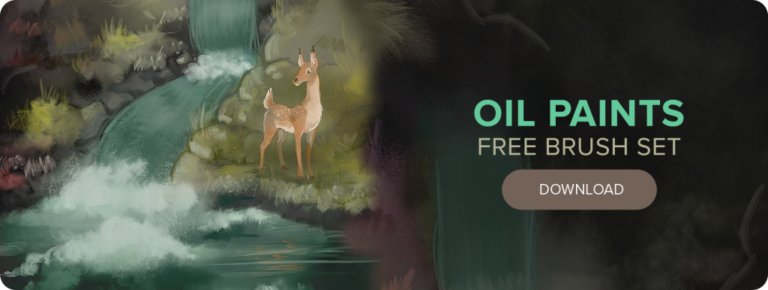

# Brush kits folder

\*Brush kits are ranked in the order of related blog's date.\*

\*Click on image to download\*

\*Tip: Ctrl/Command + F to search inside this page. Table of Content is on the left of header, displayed as <svg aria-hidden="true" height="16" viewBox="0 0 16 16" version="1.1" width="16" data-view-component="true" style="vertical-align:middle">
    <path fill-rule="evenodd" d="M2 4a1 1 0 100-2 1 1 0 000 2zm3.75-1.5a.75.75 0 000 1.5h8.5a.75.75 0 000-1.5h-8.5zm0 5a.75.75 0 000 1.5h8.5a.75.75 0 000-1.5h-8.5zm0 5a.75.75 0 000 1.5h8.5a.75.75 0 000-1.5h-8.5zM3 8a1 1 0 11-2 0 1 1 0 012 0zm-1 6a1 1 0 100-2 1 1 0 000 2z"></path>
</svg>

## Free Brushes: Oils

**Release date**: August 8, 2016

**Original blog link**: https://blogs.autodesk.com/sketchbookpro/oil-paints-free-brush-set/

**Archived blog link**: _TBA_